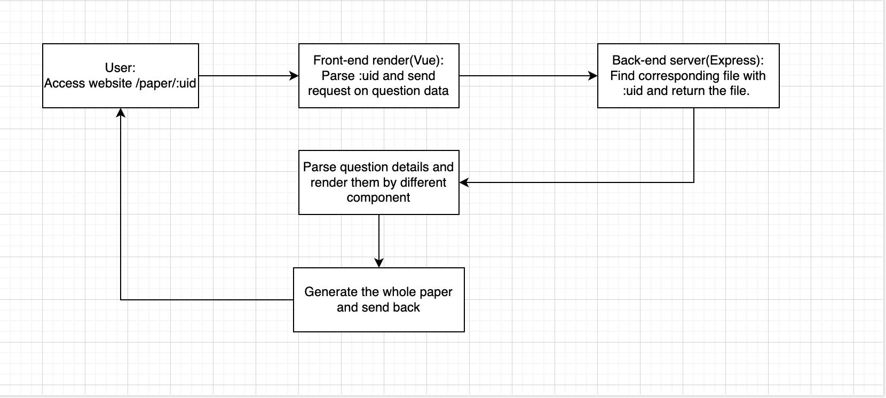

## 0. General introduction
### Purpose Statement
We observed:
1. Students are struggling to find a website allowing them to custom their question and finish online.
2. Students may want to save mistake question and do it again.
3. Students found hard to use online survey platform.<br>
    E.g., Microsoft Form has a bad access speed from mainland, which is not adapted for the wide research held in mainland;<br>
    wjx/wenjuan.cn/mikecms: charges for high amount of response;<br>
    Tencent Form require using WeChat, which some people may not be willing to use, or oversea users may find hard use.

### Feature of our project
1. Individual; Seperated front-end and back-end, a more flexible option user can take;
2. Lite; Using Express as back-end, and Vue for front-end.
3. API access; Allowing user to customise their own back-end/front-end by our well-developed API.
4. Scalable data; Saved data in json format; easy for user to re-develop or export file sharing with others. 
5. Modular; Seperated render of different type question into module. 

## 1. Project introduction
### File tree
```.
├── public/
│   └── paper/
│       ├── index.html
│       ├── readme.md
│       ├── details/
│       │   └── bf029ad9-447e-4155-b1e9-3d305526b081.json
│       └── ms/
│           └── c37a92fe1f326e0f4ce3751ad606f3f1.json
├── dist/
│   └── index.html
├── readme/
│   ├── index.md
│   └── img/
│       ├── default.png
│       └── general-work.png
├── routes/
│   ├── api.js
│   ├── users.js
│   └── index.js
├── service/
│   └── verifyAnswer.js
├── view/
│   ├── index.html
│   └── src/
│       ├── App.vue
│       ├── main.js
│       ├── output.css
│       ├── router.js
│       ├── source.css
│       └── views/
│           ├── preview.vue
│           ├── render.vue
│           ├── fallback.vue
│           └── component/
│               ├── addMultiple.vue
│               ├── addStructure.vue
│               ├── mulitple.vue
│               ├── status.vue
│               ├── structureMultiple.vue
│               └── structureSingle.vue
├── app.js
├── package.json
├── package-lock.json
├── server.js
├── tailwind.config.js
└── vite.config.js
```
For some important files/folder:
1. `app.js` config of Express.
2. `server.js` entrance file of starting Express server.
3. `view/src/views/` files of vue component.
4. `view/src/views/render.vue` the page on layout question paper.
5. `dist/*` is the static file generated by Vue after compiling.

### Module introduction
We seperated the render of different type of questions into modules in purpose of providing a flexible way to access and render multiple amount of question. We put component of single unit(module) under `view/src/views/component`. The page will integrate component and delivered to user under `view/src/views`. We will only intro some featured module here. 

1. `view/src/views/render.vue` the page on delivery paper content to user. This page will call endpoint of JSON file which include question details, and send details to different component for rendering. Also, the submit function is also inside this file. 
```vue
...
## Annotations will started with '##'

<div class="card w-10/12 bg-accent-focus/50 mx-auto">
  <div class="card-body items-center">
    <h1 class="card-title text-2xl">{{ responseData.name }}</h1>
    <div class="text-sm font-thin">
      {{ responseData.details }}
    </div>
  </div>
</div>

<status :currentStatus="receivedValue"></status>
<div v-for="(i, index) in responseData.question" :key="index"> 
  
  ## The line above check the type of the question, and render it by loading corresponding module. 
  
  <multiple v-if="i.type === 'c-s'" :questionDetails="i" :questionId="index+1" @action="handleReceive"/>
  
  ## Using the feature of Vue to bind attribute dynamically and also transfer data between parent component and children component. 
  ## :questionDetails to send question information to children; @action used for parent module(render.vue) receive data from children component.
  
  <structure-s v-if="i.type === 'a-s'" :questionDetails="i" :questionId="index+1" @action="handleReceive"/>
  <structure-m v-if="i.type === 'a-m'" :questionDetails="i" :questionId="index+1" @action="handleReceive"/>
  <br>
</div>
<div class="items-center w-fit mx-auto">
  <button class="btn btn-accent btn-md mx-auto" @click="submitAnswer">Check answer</button>
  
  ## Use JS to get data and submit request to avoid using 'form' to reload page. This also provide more flexibility on design. 
  
</div>
...
```
2. `view/src/views/component/status.vue` we add a status tracker to give user a glance of how many question this form has and how many they complete. 


### Client&Server communication model
1. Access specific paper

The diagram above shows how does we render the user interference page.
2. Selecting options

3. Submit answer


### User interference


## 2. Extend resource
### JSON structure
We provide an example JSON file for question paper and corresponding answer at 
```
#Reference for question paper
public/papers/details/bf029ad9-447e-4155-b1e9-3d305526b081.json

#Reference for answer
public/papers/ms/c37a92fe1f326e0f4ce3751ad606f3f1.json
```
#### Question paper&details
```json
{
  "name": "Example Chinese Paper",
  "uid": "bf029ad9-447e-4155-b1e9-3d305526b081",
  "details": "Reference: 9702_s22_qp_23, 9702_s22_qp_12. Copyright to Cambridge International Assessment",
  "open": "true",
  "question": [
    {
      "uid": 17171919,
      "description":
      "Which estimate is reasonable?",
      "type":"c-s",
      "sub": [
        "1*10–3 kg for the mass of a grain of sand",
        "1*10–2 m3 for the volume of a tennis b",
        "1*100 J for the work done lifting an apple from waist height to head height",
        "1*104W for the power of a light bulb in a house"
        ]
    },
    {
      "uid": 234798912,
      "description":
      "A solid metal sphere has a diameter of (3.42 ± 0.02) cm and a mass of (67 ± 2)g. Calculate the density of metal",
      "type": "a-s",
      "sub":[]
    },
    {
      "uid": 1290932,
      "description":
      "A solid metal sphere has a diameter of (3.42 ± 0.02) cm and a mass of (67 ± 2)g. ",
      "type": "a-m",
      "sub":[
        "Calculate density of metal", "Determine the percentage uncertainty in density"
      ]
    }
  ]
}
```
`name`: Necessary, Title of paper you wish to show at page. *Type: `String`*

`uid`: Necessary, identifier for your paper; this code should be unique under your system, and make sure your file have the same name. *Type: `String`*

`details`: Optional, showing some additional information under title. *Type: `String`*

`open`: Necessary, used to distinguish if this form is for check answer or save submit data only. Use `true` for former and `false` for latter. *Type: `String`*


### API
*We assume you already finish reading description of JSON before you enter this chapter*

